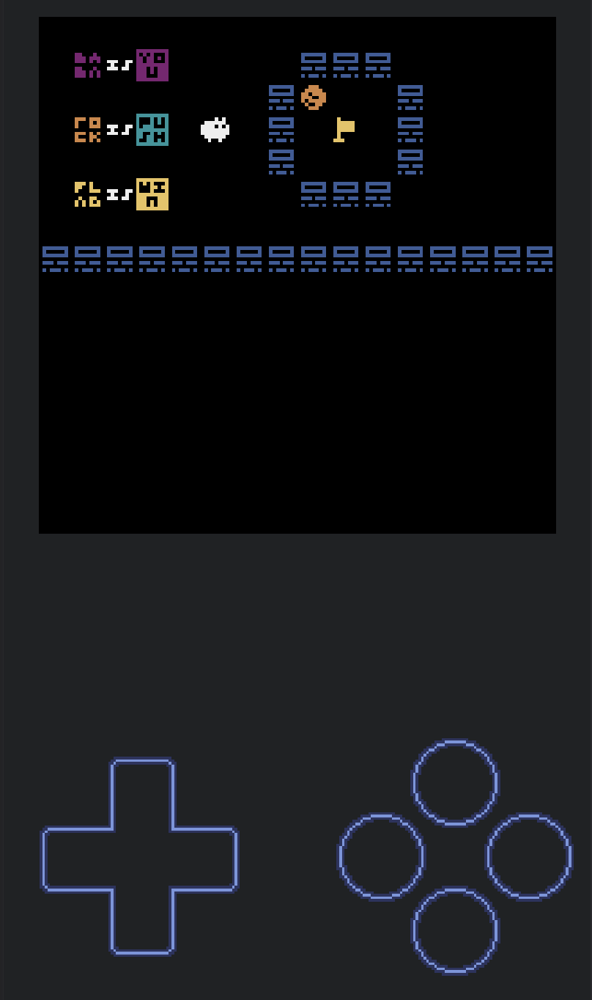

# I made a BABA IS YOU demake!

You can play it [here](https://kitao.github.io/pyxel/wasm/launcher/?play=Fraser-Greenlee.baba-is-you.baba-is-you-game&gamepad=enabled) and view the source code [here](https://github.com/Fraser-Greenlee/baba-is-you).

The whole thing is made with [Pyxel](https://github.com/kitao/pyxel) a retro game engine for Python.
Now with Web Assembly you can easily export Pyxel games to the browser!

